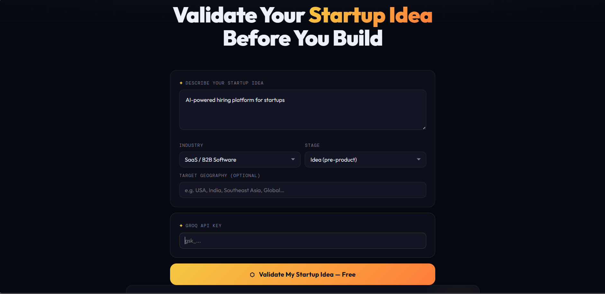
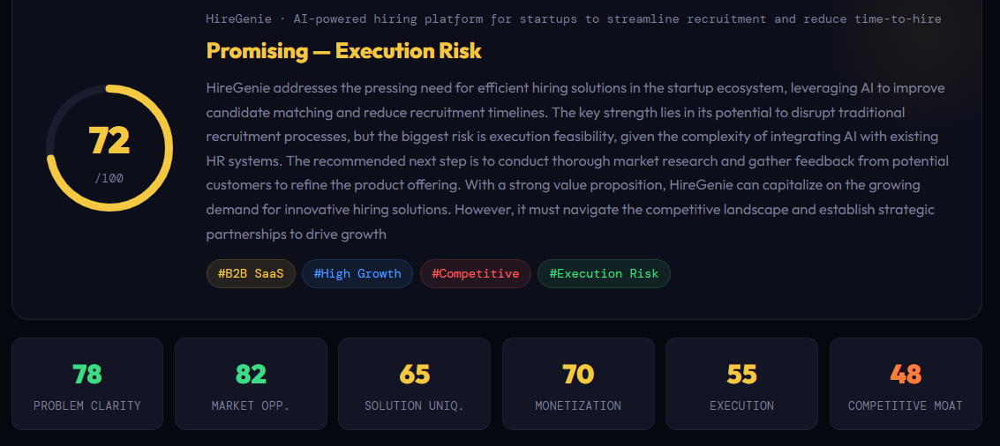
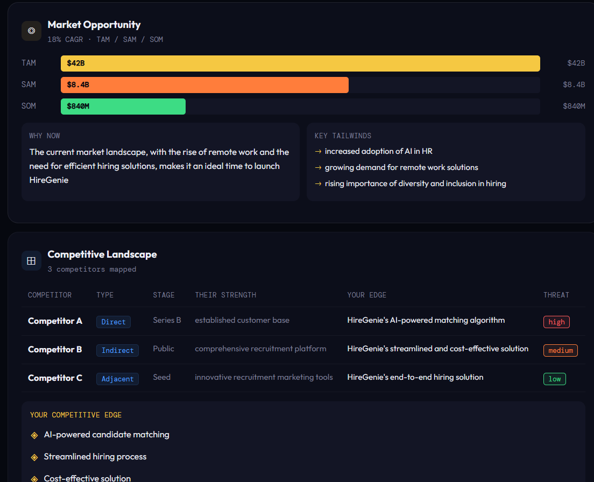
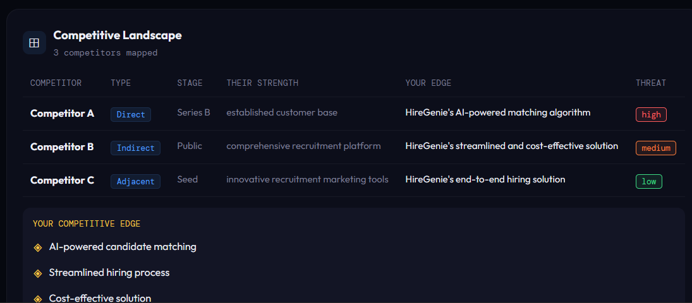

# Forge — AI Startup Validator

Forge is an AI-powered startup validation platform that helps founders and product teams evaluate startup ideas using market analysis, competitor intelligence, monetization insights, and investor-style feedback.

---

# Live Demo

https://forge-validator.netlify.app/

---

# Overview

Forge helps users evaluate startup ideas by generating:
- startup validation scores
- market opportunity analysis
- competitor insights
- monetization strategies
- investor-style feedback
- roadmap recommendations
- execution risk analysis

The platform simulates AI-assisted startup intelligence workflows using dynamic business analysis and structured product reasoning.

---

# Features

## AI Startup Scoring
Generate:
- startup viability scores
- execution feasibility analysis
- business attractiveness
- monetization potential
- market opportunity ratings

---

## Market Intelligence
Analyze:
- TAM / SAM / SOM
- industry growth trends
- market demand
- opportunity size
- category competition

---

## Competitor Analysis
Compare:
- direct competitors
- indirect competitors
- positioning strategies
- competitive advantages
- differentiation opportunities

---

## Audience Persona Generation
Generate:
- target user personas
- customer pain points
- buying motivations
- adoption barriers
- user behavior insights

---

## Monetization Strategy Engine
Suggest:
- subscription models
- freemium strategies
- pricing ideas
- revenue streams
- growth opportunities

---

## Risk Analysis
Identify:
- execution risks
- market challenges
- scalability concerns
- operational limitations
- competition threats

---

## Product Roadmap Generator
Generate:
- MVP recommendations
- launch priorities
- growth milestones
- scaling roadmap
- go-to-market suggestions

---

## Investor Perspective
Simulate:
- investor feedback
- startup attractiveness
- funding readiness
- growth potential
- business strengths and weaknesses

---

# Dynamic AI Analysis System

Forge uses dynamic AI-style business analysis workflows.

Every startup idea generates:
- startup scores
- competitor evaluations
- monetization insights
- market analysis
- risk assessments
- strategic recommendations

This creates realistic startup validation simulations without requiring backend infrastructure.

---

# Tech Stack

- HTML
- CSS
- JavaScript
- Groq API
- Llama 3.3 70B

---

# Screenshots

## Startup Validation Dashboard

## Problem Analysis

## Market Opportunity

## Competitive Landscape

---

# Key Product Questions Solved

Forge helps answer questions like:

- Is this startup idea worth building?
- How competitive is the market?
- What are the biggest business risks?
- Which monetization model fits best?
- Who are the target users?
- What should the MVP roadmap look like?
- How attractive is this idea from an investor perspective?

---

# Why I Built This

I built Forge to explore:
- startup validation workflows
- AI-assisted business analysis
- product strategy thinking
- founder decision-making systems
- market intelligence simulations

The goal was to simulate how founders and product teams evaluate startup opportunities before investing time and resources into building products.

---

---
